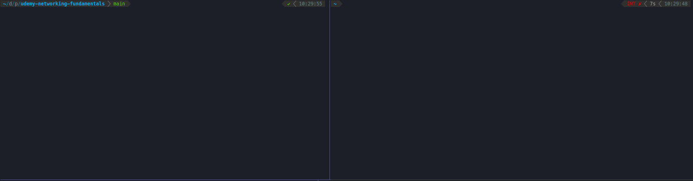

# Fundamentals of Networking for Effective Backend Design

Exercises and code from Hussein Nasser's Course [Fundamentals of Networking for Effective Backend Design](https://www.udemy.com/course/fundamentals-of-networking-for-effective-backend-design).

## How to Run

Install the [latest Go version](https://go.dev/) on your computer if it is not already installed.
Also, if running the Nodejs servers, install the [LTS Version](https://nodejs.org/en/).

Then, go to the `udpserver` or `tcpserver` respective directories and execute the following command:

Go:

```bash
go run main.go
```

Nodejs:

```bash
node index.mjs
```

In your terminal, use the Netcat utility to make the requests.

```bash
# TCP
nc -t 127.0.0.1 5500

# UDP
nc -u 127.0.0.1 5500
```



Note: I have improved the TCP and UDP servers in Go after reading [this article](https://www.linode.com/docs/guides/developing-udp-and-tcp-clients-and-servers-in-go/) from Linode.

## Nagle's Algorithm

This algorithm can affect network performance and to understand it better [this article](https://blog.gopheracademy.com/advent-2019/control-packetflow-tcp-nodelay/) explains the problems with it.

Run `tcpdump` to observe the behavior.

```bash
sudo tcpdump -X  -i lo0 'port 8000'
```

Go to the `tcp-nodelay-go` directory and execute the client and servers.

```bash
go run client.go
go run server.go
```

Then, disable `TCP_NODELAY` to see it in action in the `client.go` file.

```go
conn.SetNoDelay(false) // Disable TCP_NODELAY; Nagle's Algorithm takes action.
```

It is also important to know the Delayed Acknowledgement algorithm, because when it works together with Nagle's Algorithm, we may have 400ms delays. The `TCP_QUICKACK` is the socket option to disable it. [Read more](https://www.extrahop.com/company/blog/2016/tcp-nodelay-nagle-quickack-best-practices/).

## License

[MIT](LICENSE) © André Brandão
